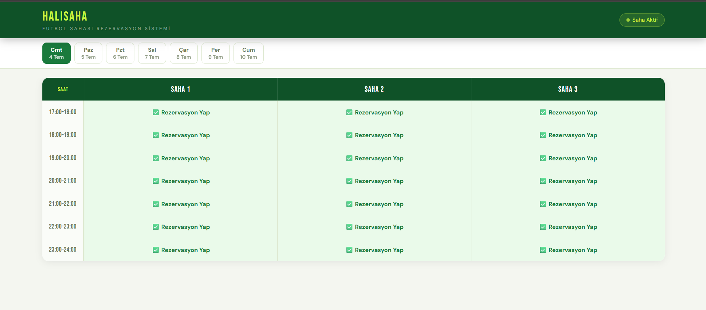
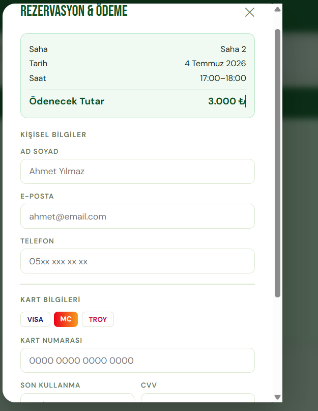
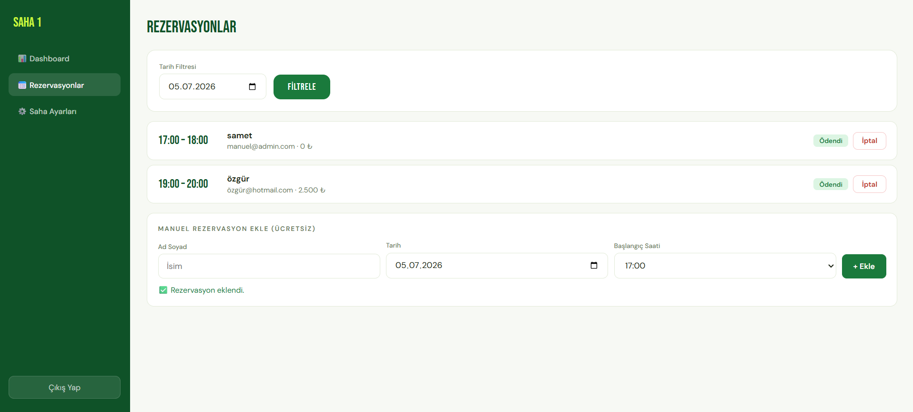

# Halısaha Rezervasyon Sistemi

Halısaha sahipleri için geliştirilmiş, kullanıcıların online rezervasyon yapıp ödeme yapabildiği, sahiplerin de admin panelinden rezervasyonları yönetebildiği bir web uygulaması.

## Ekran Görüntüleri

### Rezervasyon Sayfası


### Ödeme Formu


## Ödeme Onaylandı Sayfası


### Admin Paneli – Rezervasyonlar


## Özellikler

- 🗓️ Tarih ve saat aralığı seçerek rezervasyon yapma (17:00–24:00 arası, saha bazlı özelleştirilebilir)
- 🏟️ Birden fazla saha desteği (yan yana karşılaştırmalı tablo görünümü)
- 💳 Kart bilgisi giriş formu (gösterim amaçlı, gerçek ödeme altyapısı entegre edilebilir)
- 👤 Kullanıcı kaydı gerektirmeden hızlı rezervasyon
- 🔐 JWT tabanlı admin girişi
- 📊 Admin paneli: günlük/haftalık gelir istatistikleri, rezervasyon listesi
- ➕ Admin tarafından manuel (ücretsiz) rezervasyon ekleme
- ❌ Rezervasyon iptali sadece admin yetkisiyle

## Teknolojiler

**Backend:** ASP.NET Core Web API (.NET), Entity Framework Core, SQL Server, JWT Authentication, BCrypt
**Frontend:** HTML, CSS, Vanilla JavaScript
**Diğer:** MailKit (e-posta altyapısı, opsiyonel)

## Kurulum

1. `appsettings.json` dosyasını kendi bilgilerinizle doldurun (JWT anahtarı, veritabanı bağlantısı, e-posta bilgileri)
2. Package Manager Console'da migration'ları uygulayın:
   ```
   Update-Database
   ```
3. Projeyi çalıştırın (F5)
4. `/swagger` üzerinden `POST /api/auth/admin-kayit` ile ilk admin hesabınızı ve sahanızı oluşturun
5. `http://localhost:PORT` → Rezervasyon sayfası
6. `http://localhost:PORT/admin.html` → Admin paneli

## Notlar

Bu proje bir portföy/öğrenme çalışmasıdır. Ödeme formu gösterim amaçlıdır; gerçek bir üretim ortamında iyzico, PayTR gibi bir ödeme altyapısı ile entegre edilmesi gerekir.